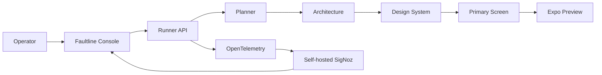
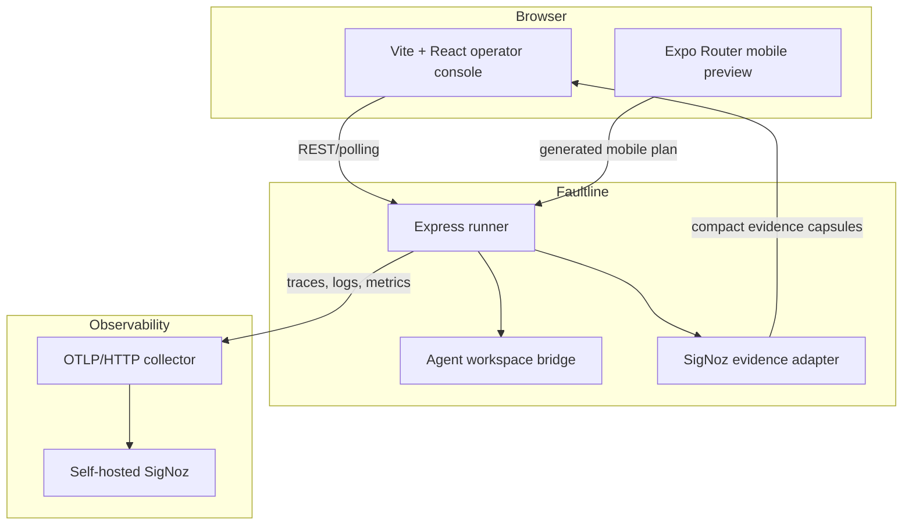

# Faultline

**Faultline is a self-hosted investigation console for AI agent runs.** It turns a real OpenAI-compatible mobile-app workflow into an operator-readable causal path, then uses self-hosted [SigNoz](https://signoz.io/) as the evidence store for traces, logs, metrics, and alerts.

Instead of building another observability dashboard, Faultline helps an operator answer a narrower question: *which agent went wrong, what did it decide, what did it send to the model, and where is the native telemetry evidence?*

## What It Does

- Runs a real OpenAI-compatible workflow: **Planner -> Architecture -> Design system -> Primary screen -> Expo preview**.
- Shows each agent as it works, including full system prompts, task prompts, model output, artifacts, retries, and timestamped execution events.
- Creates an interactive Expo mobile preview with Home, Activity, Insights, and Profile views generated from the app brief.
- Sends OpenTelemetry traces, structured logs, and metrics to **self-hosted SigNoz**.
- Demonstrates an injected incident: a real model call is retried after an explicit timeout and the intentionally low token budget produces a recorded breach.
- Links operators to the exact native SigNoz trace, correlated logs, alert, or dashboard instead of reimplementing those surfaces.

## Product Flow



## Architecture



### Packages

| Workspace | Responsibility | Main technologies |
| --- | --- | --- |
| `apps/console` | Agent-run investigation UI | Vite, React, TypeScript, Lucide |
| `apps/runner` | Orchestration, LLM calls, OTEL, evidence API | Node.js, Express, OpenTelemetry |
| `apps/bridge` | Isolated agent workspace lifecycle | Node.js, Express |
| `apps/preview` | Interactive generated mobile app | Expo SDK 52, Expo Router, React Native |
| `infra/signoz` | Local observability deployment | Docker Compose, self-hosted SigNoz |

## Quick Start

### Prerequisites

- Node 20 installed through `nvm` (`nvm install 20`)
- Docker Desktop
- An OpenAI-compatible API key and base URL

### Configure

```bash
git clone https://github.com/harishkotra/faultline.git
cd faultline
cp .env.example .env
npm install
```

Update `.env` with an OpenAI-compatible provider:

```dotenv
OPENAI_BASE_URL=https://your-provider.example/v1
OPENAI_API_KEY=your-api-key
OPENAI_MODEL=your-model

SIGNOZ_OTLP_ENDPOINT=http://localhost:4318
SIGNOZ_UI_URL=http://localhost:8080
```

### Start SigNoz

```bash
cd infra/signoz
chmod +x bootstrap.sh
./bootstrap.sh
cd ../..
npm run signoz:up
```

Open `http://localhost:8080` and complete the one-time SigNoz administrator setup before sending telemetry.

### Start Faultline

```bash
npm run dev
```

| Service | URL |
| --- | --- |
| Faultline Console | `http://localhost:5173` |
| Runner API | `http://localhost:4310` |
| Workspace Bridge | `http://localhost:4320` |
| Expo web preview | `http://localhost:8081` |
| SigNoz | `http://localhost:8080` |

The Expo startup script deliberately uses the locally installed Node 20 runtime, even if another Node version is active in the shell. This avoids unsupported Expo SDK 52 behavior under Node 26.

## Run A Demo

1. Open the console and enter a mobile-app brief.
2. Select **Healthy run** and click **Run mobile build**.
3. Watch the causal path move from queued to working to complete. Select an agent to inspect its prompt, model output, and artifact events.
4. Open the Expo preview to use the generated mobile experience.
5. Run **Injected incident**. Faultline records an Architecture timeout, retry, and an intentional token-budget breach.
6. Select Architecture and use the SigNoz evidence capsules to open the correlated trace, logs, or alert.

## Telemetry Model

The runner keeps only operational metadata required for the live investigation. SigNoz is the telemetry authority.

```ts
await inSpan('agent.architecture', {
  'faultline.run_id': run.id,
  'faultline.agent_id': 'architecture',
}, async () => {
  logEvent(taskPrompt, {
    'faultline.event': 'model.request',
    'faultline.run_id': run.id,
    'faultline.agent_id': 'architecture',
  });

  return invokeModel(taskPrompt);
});
```

Each run emits:

- `agent.run`, per-agent, LLM request, retry, artifact-write, and preview-publish spans.
- Structured log bodies for prompts, model responses, retries, artifacts, and failures.
- Counters and histograms for run outcomes, token use, durations, retries, and budget breaches.
- Correlation attributes: `faultline.run_id`, `faultline.agent_id`, scenario, trace ID, and model metadata.

## API Surface

```text
POST /api/runs
GET  /api/runs
GET  /api/runs/:runId
GET  /api/runs/:runId/agents/:agentId
GET  /api/preview/:runId
GET  /health
```

The agent endpoint returns a complete investigation dossier: decision, full prompts, model output, artifacts, span references, execution events, and a maximum of three normalized SigNoz evidence capsules.

## Development

```bash
npm run build
npm test
```

To validate the mobile preview independently:

```bash
cd apps/preview
npm run web
```

## Forking And Contributing

1. Fork the repository and create a branch with a focused name.
2. Keep changes within the owning workspace where possible.
3. Never commit `.env`, local SigNoz data, generated Expo files, or agent workspace state.
4. Run `npm run build` and `npm test` before opening a pull request.
5. For UI work, test the console and Expo preview on desktop and mobile-sized viewports.

Useful contribution directions:

- Add a durable metadata store so completed investigations survive runner restarts.
- Add approval checkpoints before expensive or destructive agent stages.
- Support a configurable pipeline with parallel screen-generation agents.
- Add redaction policies for prompt and output logs in multi-tenant deployments.
- Add a SigNoz dashboard provisioning script using the native API.
- Expand the generated mobile-plan schema with domain-specific forms, offline data, and richer interactions.
- Add Playwright browser coverage for the console and Expo preview.

## Repository Layout

```text
apps/
  bridge/       Agent workspace bridge
  console/      Operator investigation interface
  preview/      Expo generated-app renderer
  runner/       Workflow, LLM, telemetry, and evidence API
infra/signoz/   Self-hosted SigNoz bootstrap and compose configuration
docs/           Technical deep dive and launch copy
tests/          Contract tests
```